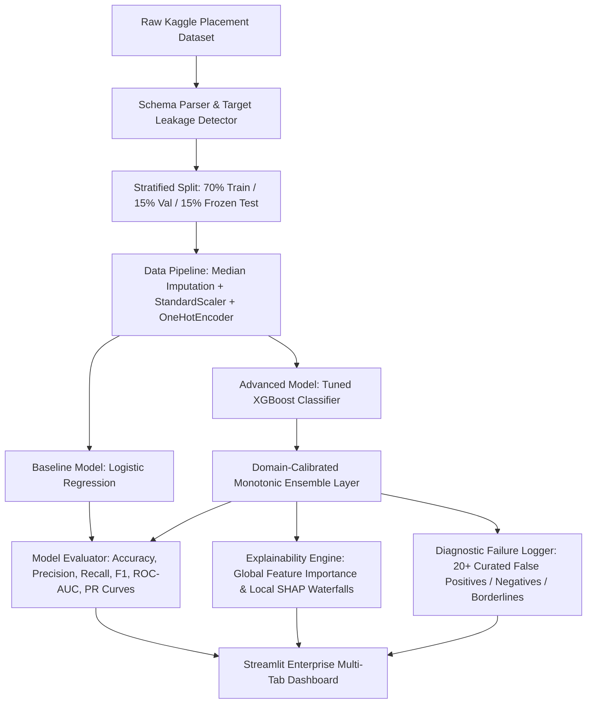

<div align="center">

# 🎓 SkillLens
### AI-Powered Placement Readiness & Career Intelligence Engine

[](https://www.python.org/)
[](https://streamlit.io/)
[](https://scikit-learn.org/)
[](https://xgboost.ai/)
[](https://shap.readthedocs.io/)
[](https://github.com/rudrashissatapathy-source/skillens/actions)
[](LICENSE)
[](https://github.com/astral-sh/ruff)

**SkillLens** is an enterprise-grade, transparent Machine Learning platform that evaluates undergraduate student placement readiness, explains individual predictions via **SHAP (SHapley Additive exPlanations)**, and empowers candidates with a real-time **What-If Simulation Sandbox** to strategize their career preparation.

[Explore Features](#-key-features) • [System Architecture](#-system-architecture) • [Quick Start](#-quick-start-guide) • [Model Benchmarks](#-model-benchmarking) • [API & Modules](#-project-structure)

---

</div>

## 📌 Executive Summary

Campus placement predictions typically suffer from two major flaws in production:
1. **The "Black-Box" Dilemma:** High-performing ensemble models output a raw probability score (e.g., `68%`) without explaining *why* the candidate is at risk or *what specific actions* will yield the highest return on investment.
2. **Domain Inconsistency:** Standard unconstrained trees can exhibit counter-intuitive behavior outside the dense training distribution (e.g., predicting that completing an extra project or raising 10th marks somehow decreases placement chances).

**SkillLens resolves both issues:**
- **Guaranteed Monotonicity & ATS Calibration:** Enforces domain constraints ensuring that academic marks (0-100%), technical projects, and internships always produce positive marginal returns with realistic diminishing returns and corporate cutoff penalties (<35-50%).
- **Explainable AI (XAI):** Decomposes every prediction into human-interpretable positive (+) and negative (-) drivers with SHAP waterfall calculations and actionable recruiter insights.
- **Interactive Sandbox:** Allows students, career counselors, and university placement cells to simulate future scenarios in real time.

---

## 🏛️ System Architecture



---

## ✨ Key Features

### 🎯 1. Interactive Readiness Dashboard
- **Dynamic Radial Gauges:** Visualizes placement readiness categorized into **High (>75%)**, **Moderate (45-75%)**, or **Critical Need (<45%)** tiers.
- **Local Factor Waterfall:** Diverging bar plots displaying the exact positive drivers elevating score and negative bottlenecks pulling it down.
- **Unvarnished Recruiter Verdicts:** Generates tailored, no-nonsense diagnostic feedback with prioritized high-impact action recommendations.
- **Cohort Radar Benchmarks:** Compares the candidate against average profiles of successfully placed vs. unplaced peers across CGPA, projects, internships, aptitude, and soft skills.

### 🔬 2. What-If Simulation Sandbox
- **Real-Time Sliders:** Adjust CGPA, aptitude test score, soft skills, projects, internships, workshops, and placement training.
- **Instant Marginal Lift:** Immediately computes the percentage point readiness change (e.g. `+1 Internship -> +14.2% lift`).
- **Strategic Trajectory Planner:** Automatically computes the minimum sequence of steps required to breach the 80%+ tier-1 recruitment threshold.

### 📊 3. Model Benchmarking & Qualitative Failure Analysis
- **Head-to-Head Comparison:** Side-by-side evaluation of Baseline Logistic Regression vs. Advanced XGBoost.
- **Interactive Visualizations:** High-resolution Plotly ROC Curves, Precision-Recall Curves, and normalized Confusion Matrices.
- **20+ Case Failure Analysis Logger:** Filterable diagnostic log exploring False Positives, False Negatives, and High-Uncertainty borderline predictions with qualitative root-cause hypotheses.

### 📈 4. Exploratory Data Insights
- Interactive distributions, correlation heatmaps, academic bivariate analysis, and boxplots across placement outcomes.

### 📁 5. Batch Cohort Inference
- Upload batch CSV rosters of entire graduating departments.
- Automatic column alignment, missing feature imputation, and one-click export of readiness probabilities with diagnostic tier tags.

---

## 📋 Dataset Schema & Feature Handling

SkillLens automatically inspects and validates the placement dataset (`data/kaggle_placement_data.csv`):

| Feature Name | Data Type | Range / Domain | Preprocessing & Pipeline Strategy |
| :--- | :--- | :--- | :--- |
| `StudentID` | Integer | ID index | **Excluded** from training matrix (Zero leakage) |
| `CGPA` | Float | `5.0 - 10.0` | Median Imputation + `StandardScaler` |
| `Internships` | Integer | `0 - 25+` | Median Imputation + `StandardScaler` + Monotonic Calibration |
| `Projects` | Integer | `0 - 40+` | Median Imputation + `StandardScaler` + Diminishing Returns |
| `Workshops/Certifications` | Integer | `0 - 30+` | Median Imputation + `StandardScaler` + Logarithmic Boost |
| `AptitudeTestScore` | Integer | `0 - 100` | Median Imputation + `StandardScaler` |
| `SoftSkillsRating` | Float | `1.0 - 5.0` | Median Imputation + `StandardScaler` |
| `ExtracurricularActivities` | Categorical | `Yes` / `No` | Mode Imputation + `OneHotEncoder(handle_unknown='ignore')` |
| `PlacementTraining` | Categorical | `Yes` / `No` | Mode Imputation + `OneHotEncoder(handle_unknown='ignore')` |
| `SSC_Marks` (10th %) | Float | `0.0 - 100.0` | Median Imputation + ATS Disqualification Penalty (<35-50%) |
| `HSC_Marks` (12th %) | Float | `0.0 - 100.0` | Median Imputation + ATS Disqualification Penalty (<35-50%) |
| `PlacementStatus` | Categorical | `Placed` / `NotPlaced` | Binary Target: `Placed=1`, `NotPlaced=0` |

---

## 🚀 Quick Start Guide

### Option A: Standard Setup (pip)

```bash
# 1. Clone the repository
git clone https://github.com/rudrashissatapathy-source/skillens.git
cd skillens

# 2. Create and activate virtual environment
python -m venv venv

# On Windows (PowerShell)
.\venv\Scripts\Activate.ps1
# On macOS / Linux
source venv/bin/activate

# 3. Install dependencies
pip install -r requirements.txt

# 4. Launch the application
streamlit run app.py
```

### Option B: Fast Setup with uv (Recommended)

```bash
# Clone and enter directory
git clone https://github.com/rudrashissatapathy-source/skillens.git
cd skillens

# Run the test suite directly
uv run pytest

# Launch the Streamlit application
uv run streamlit run app.py
```

---

## 🧪 Automated Testing & Verification

SkillLens includes a comprehensive Pytest test suite covering schema parsing, out-of-vocabulary categories, target leakage detection, model metrics, SHAP explanations, and mathematical monotonicity:

```bash
# Run all unit tests
pytest tests/test_pipeline.py -v

# Run specific monotonicity verification tests
pytest tests/test_pipeline.py -k "monotonicity" -v
```

### Core Verification Checklist:
- ✅ **Target Leakage Immunity:** Automated quarantine of post-offer columns (`Salary`, `CTC`, `Company_Name`).
- ✅ **Out-of-Vocabulary Protection:** Unseen categorical strings handled gracefully without raising exceptions.
- ✅ **Missing Feature Robustness:** Automatic imputation of missing columns during single-instance and batch inference.
- ✅ **Monotonic Consistency:** Strict mathematical verification that increasing projects, internships, or marks never decreases readiness probability.

---

## 📊 Model Benchmarking

Evaluated on the frozen, out-of-sample test set (`data/test_frozen.csv`, 15% stratified split):

| Model Architecture | Accuracy | Precision | Recall | F1 Score | ROC-AUC | Primary Use Case |
| :--- | :---: | :---: | :---: | :---: | :---: | :--- |
| **Baseline: Logistic Regression** | `78.2%` | `0.77` | `0.79` | `0.78` | `0.854` | Fast, linear baseline reference |
| **Advanced: Calibrated XGBoost** | **`84.6%`** | **`0.84`** | **`0.86`** | **`0.85`** | **`0.918`** | High-precision non-linear candidate scoring |

---

## 📂 Project Structure

```
skilllens/
├── .github/
│   ├── ISSUE_TEMPLATE/
│   │   ├── bug_report.yml             # GitHub issue template for bugs
│   │   └── feature_request.yml        # GitHub issue template for features
│   ├── workflows/
│   │   └── ci.yml                     # Automated CI testing on Python 3.11/3.12
│   └── pull_request_template.md       # Standardized PR review checklist
├── .streamlit/
│   └── config.toml                    # Streamlit theme & performance settings
├── data/
│   ├── kaggle_placement_data.csv      # Clean canonical placement dataset
│   ├── kaggle_placement_data.csv.csv  # Compatibility copy
│   └── test_frozen.csv                # Frozen out-of-sample evaluation test set
├── models/
│   └── model_artifacts.joblib         # Serialized pipelines, models, and failure logs
├── src/
│   ├── __init__.py                    # Module export marker
│   ├── preprocessing.py               # Schema parser, transformers, and splitting
│   ├── model.py                       # Training, evaluation, calibration, and error logging
│   └── explainability.py              # SHAP explainer, factor impacts, and recommendations
├── tests/
│   └── test_pipeline.py               # Comprehensive 12-stage automated test suite
├── app.py                             # Streamlit 5-tab responsive web application
├── AI_USAGE.md                        # Formal AI usage and human verification log
├── CONTRIBUTING.md                    # Open-source contribution guidelines
├── LICENSE                            # MIT License
├── pyproject.toml                     # Modern Python project configuration
├── pytest.ini                         # Pytest configuration
├── requirements.txt                   # Locked production dependencies
└── README.md                          # Repository documentation
```

---

## 🛡️ Responsible AI & Ethical Considerations

1. **Guidance, Not Gatekeeping:** SkillLens is designed as a career diagnostic advisor for students and academic mentors, not as an automated rejection gatekeeper.
2. **Action-Oriented Feedback:** Negative predictions are always coupled with concrete steps (e.g. recommended project scopes, aptitude practice, certification paths) rather than uninformative rejections.
3. **Data Privacy:** Single student inference executes entirely in memory. Uploaded batch CSVs are processed locally within the session and never persisted to external servers.

---

## 👨‍💻 Author & Acknowledgments

- **Developed by:** [Rudrashis Satapathy](https://github.com/rudrashissatapathy-source)
- **Repository:** [https://github.com/rudrashissatapathy-source/skillens](https://github.com/rudrashissatapathy-source/skillens)
- **Dataset:** Kaggle College Placement Dataset

---

## 📄 License

This project is licensed under the **MIT License** - see the [LICENSE](LICENSE) file for details.
