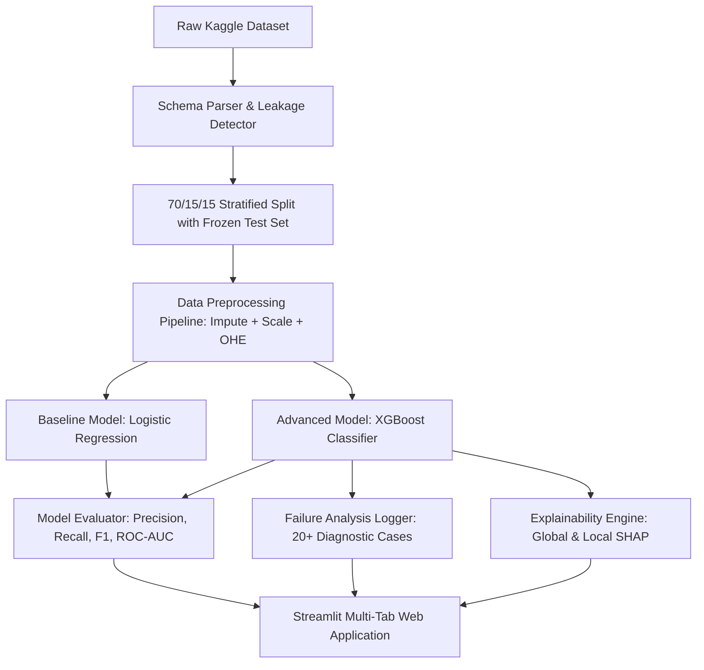

# 🎓 SkillLens: AI-Powered Placement Readiness & Career Intelligence Engine

SkillLens is a production-grade Machine Learning web application designed to evaluate student placement readiness, explain predictions using **SHAP (SHapley Additive exPlanations)** and feature contributions, and provide an interactive **What-If Simulation Sandbox** for real-time skill optimization.

---

## 🏛️ System Architecture



### Key Modules:
- **`src/preprocessing.py`**: Automated schema parser, target leakage detection, scikit-learn preprocessing `ColumnTransformer` (median imputation, standard scaling, one-hot encoding with out-of-vocabulary protection), and stratified dataset splitting with frozen test set preservation.
- **`src/model.py`**: Model training for Baseline (Logistic Regression) and Advanced (XGBoost / Random Forest) classifiers, evaluation metric calculation, ROC/PR curves, confusion matrices, and automated failure case logging.
- **`src/explainability.py`**: Global feature importance and local SHAP explanations, factor decomposition (+/- drivers), narrative diagnostic summaries, actionable recommendation generator, and cohort benchmarking.
- **`app.py`**: Streamlit web dashboard featuring interactive gauges, SHAP waterfall charts, real-time What-If simulation sandbox, model benchmarking, exploratory data analysis, and batch CSV predictions.
- **`tests/test_pipeline.py`**: Automated unit test suite verifying schema detection, edge cases, missing data handling, unknown categories, and pipeline idempotency.

---

## 📋 Dataset Schema

SkillLens automatically inspects and processes the placement dataset (`data/kaggle_placement_data.csv.csv`):

| Column Name | Type | Description | Handling |
| :--- | :--- | :--- | :--- |
| `StudentID` | Integer | Unique student identifier | Dropped (Excluded from training) |
| `CGPA` | Numeric Float | Cumulative Grade Point Average (5.0 - 10.0) | Median Imputation + StandardScaler |
| `Internships` | Numeric Integer | Number of completed internships | Median Imputation + StandardScaler |
| `Projects` | Numeric Integer | Number of technical capstone projects | Median Imputation + StandardScaler |
| `Workshops/Certifications` | Numeric Integer | Number of workshops/certifications | Median Imputation + StandardScaler |
| `AptitudeTestScore` | Numeric Integer | Standardized test score (0 - 100) | Median Imputation + StandardScaler |
| `SoftSkillsRating` | Numeric Float | Soft skills & communication rating (1.0 - 5.0) | Median Imputation + StandardScaler |
| `ExtracurricularActivities` | Categorical | Campus club & activity involvement ('Yes'/'No') | Mode Imputation + OneHotEncoder |
| `PlacementTraining` | Categorical | Formal placement training status ('Yes'/'No') | Mode Imputation + OneHotEncoder |
| `SSC_Marks` | Numeric Float | 10th Grade Secondary School Percentage | Median Imputation + StandardScaler |
| `HSC_Marks` | Numeric Float | 12th Grade Higher Secondary Percentage | Median Imputation + StandardScaler |
| `PlacementStatus` | Categorical (Target) | Placement Outcome ('Placed' / 'NotPlaced') | Binary Mapped (Placed=1, NotPlaced=0) |

---

## 🚀 Quick Start Guide

### 1. Environment Setup
```bash
# Clone the repository and navigate to root directory
cd skilllens

# Activate virtual environment (Windows PowerShell)
.\venv\Scripts\activate

# Install required dependencies
pip install -r requirements.txt
```

### 2. Run Automated Unit Tests
```bash
.\venv\Scripts\python.exe -m pytest tests/test_pipeline.py -v
```

### 3. Train Models & Generate Artifacts (Offline CLI)
```bash
.\venv\Scripts\python.exe -m src.model
```

### 4. Launch the Interactive Web Application
```bash
.\venv\Scripts\python.exe -m streamlit run app.py
```

---

## 🖥️ Web Application Features

### 🎯 Tab 1: Readiness Dashboard
- **Readiness Score Gauge:** Visual gauge chart classifying candidate into High (>75%), Moderate (45-75%), or Low (<45%) readiness tiers.
- **Local SHAP Feature Breakdown:** Diverging bar chart showing exact positive (+) drivers boosting placement and negative (-) drivers reducing it.
- **AI Diagnostic Summary & Action Plan:** Tailored narrative analysis and prioritized action steps.
- **Cohort Benchmarking:** Radar chart comparing candidate against average Placed and Not Placed student cohorts.

### 🔬 Tab 2: What-If Simulation Sandbox
- **Real-Time Sliders:** Adjust CGPA, projects, internships, certifications, and training.
- **Live Delta Score:** Instant recalculation of readiness score lift (e.g. `+1 Internship -> +14.2% lift`).
- **Target Trajectory Planner:** Outlines the minimum high-impact steps needed to reach >80% placement readiness.

### 📊 Tab 3: Model Performance & Failure Analysis
- **Benchmark Comparison:** Baseline (Logistic Regression) vs. Advanced (XGBoost) comparing Accuracy, Precision, Recall, F1, and ROC-AUC.
- **Interactive Visualizations:** ROC Curves and Confusion Matrices.
- **20+ Case Failure Analysis Log:** Filterable error log categorizing False Positives, False Negatives, and High-Uncertainty borderline cases with diagnostic root-cause hypotheses.

### 📈 Tab 4: Exploratory Data Insights
- Distribution plots, correlation analysis, and boxplots across placement outcomes.

### 📁 Tab 5: Batch Predictions
- Batch score graduating student cohorts by uploading a CSV file and exporting predictions.

---

## 🧪 Robustness & Edge-Case Handling

1. **Target Leakage Prevention:** Automated keyword scanning automatically strips post-placement features (e.g. Salary, Company Name) from the training matrix.
2. **Missing Data Imputation:** Median imputation for numeric features and mode imputation for categorical features.
3. **Out-of-Vocabulary Protection:** `OneHotEncoder(handle_unknown='ignore')` gracefully ignores unknown categorical levels during inference.
4. **Missing / Extra Column Immunity:** Preprocessing pipeline automatically inserts defaults for missing features and strips unmapped extraneous columns.
